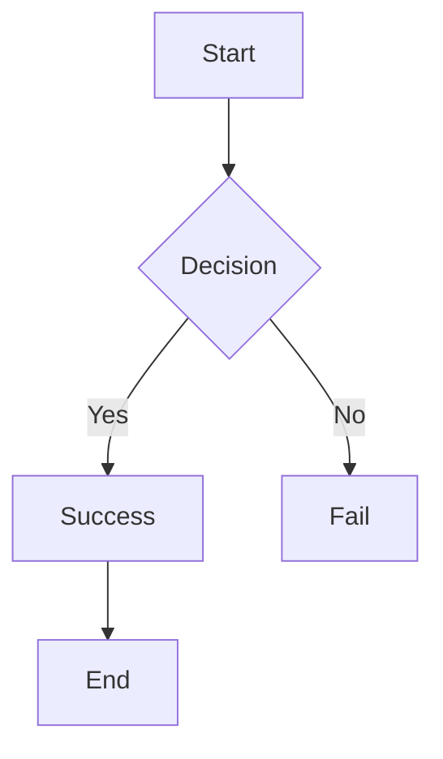
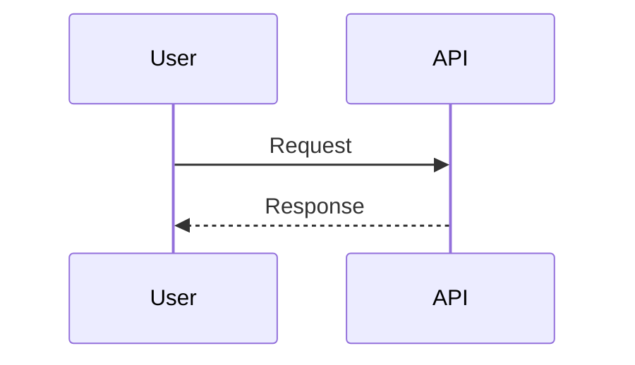

# API Reference

Complete API documentation and examples.

## Base Endpoint

```
GET https://your-project.vercel.app/api/render
```

## Request Format

Query parameters (all URL encoded):

```
?type=TYPE&content=CONTENT&[optional_params]
```

## Parameters

### Required

#### `type` (string)
Rendering type. One of:
- `html` - Render HTML content
- `markdown` - Render Markdown
- `code` - Syntax-highlighted code block
- `mermaid` - Diagram
- `component` - UI component

**Example:**
```
?type=html
```

#### `content` (string)
Content to render. Must be URL encoded.

**Max length:** 50,000 bytes

**Example:**
```
&content=%3Ch1%3EHello%3C%2Fh1%3E
```

### Optional

#### `language` (string)
Programming language (for `type=code`).

**Supported:**
```
html, css, javascript, typescript, python, java, cpp,
c, rust, go, ruby, php, bash, markdown, json, yaml, sql
```

**Default:** `plaintext`

**Example:**
```
&language=python
```

#### `css` (string)
Custom CSS (for `type=html`).

**Max length:** 10,000 bytes

**Example:**
```
&css=.card%7Bborder-radius%3A10px%7D
```

#### `title` (string)
Optional title displayed in preview.

**Max length:** 500 characters

**Example:**
```
&title=My%20Preview
```

#### `theme` (string)
Color theme.

**Options:**
- `light` (default)
- `dark`

**Example:**
```
&theme=dark
```

#### `width` (number)
SVG width in pixels.

**Range:** 300-1200  
**Default:** 800

**Example:**
```
&width=600
```

#### `height` (number)
SVG height in pixels.

**Range:** 200-3000  
**Default:** 600

**Example:**
```
&height=400
```

#### `component` (string)
Component type (for `type=component`).

**Options:**
- `stat-card`
- `badge`
- `progress`
- `chart`
- `table`
- `dashboard`

**Example:**
```
&component=badge
```

#### `data` (JSON)
Component data as JSON (for `type=component`).

**Must be URL encoded as JSON string.**

**Example:**
```
&data=%7B%22text%22%3A%22Active%22%2C%22color%22%3A%22%2328a745%22%7D
```

## Response

### Success (200 OK)

**Content-Type:** `image/svg+xml; charset=utf-8`

**Cache:** `public, max-age=3600, immutable`

Returns SVG image directly.

### Error (400-500)

**Content-Type:** `image/svg+xml; charset=utf-8`

Returns error SVG with message:

```xml
<?xml version="1.0" encoding="UTF-8"?>
<svg xmlns="http://www.w3.org/2000/svg" width="800" height="200" viewBox="0 0 800 200">
  <rect width="800" height="200" fill="#fff5f5" stroke="#dc3545" stroke-width="2"/>
  <text x="20" y="40" font-size="18" font-weight="bold" fill="#dc3545">
    ❌ Error
  </text>
  <text x="20" y="70" font-size="13" fill="#333">
    Error message here
  </text>
</svg>
```

## Type: HTML

Render HTML content with optional CSS.

### Request

```
GET /api/render?type=html&content=<html_content>[&css=<css>][&title=<title>][&theme=<theme>][&width=<width>][&height=<height>]
```

### Allowed HTML Tags

```
h1 h2 h3 h4 h5 h6
p br strong em b i
ul ol li dl dt dd
table thead tbody tr th td
blockquote pre code span div
a img button hr section article
```

### Allowed HTML Attributes

```
a: href title class
img: src alt width height class
div: class id
span: class id
[most tags]: class id
```

### Example

```
?type=html&content=%3Ch1%3EHello%3C%2Fh1%3E%3Cp%3EWorld%3C%2Fp%3E
```

### CSS Support

Custom CSS is allowed and sanitized.

```
?type=html&content=...&css=.card%7Bborder-radius%3A10px%3B%7D
```

**Blocked CSS:**
```
javascript:
@import
behavior:
expression()
-moz-binding:
```

## Type: Markdown

Render Markdown to HTML.

### Request

```
GET /api/render?type=markdown&content=<markdown_content>[&title=<title>][&theme=<theme>][&width=<width>][&height=<height>]
```

### Supported Markdown

```
# Headings
## All levels h1-h6

**bold** *italic* ***bold italic***

[links](url)

- lists
- items

1. numbered
2. lists

`inline code`

```code blocks```

| tables | headers |
|--------|---------|
| cells  | here    |

> blockquotes

---
horizontal rules
```

### Example

```
?type=markdown&content=%23%20Hello%0A%0AThis%20is%20**bold**
```

## Type: Code

Render code with syntax highlighting.

### Request

```
GET /api/render?type=code&content=<code>&language=<lang>[&title=<title>][&theme=<theme>][&width=<width>][&height=<height>]
```

### Supported Languages

```
html, css, javascript, typescript, python, java, cpp,
c, rust, go, ruby, php, bash, markdown, json, yaml, sql
```

### Example

```
?type=code&language=python&content=def%20hello%28%29%3A%0A%20%20print%28%22Hi%22%29
```

## Type: Mermaid

Render Mermaid diagrams.

### Request

```
GET /api/render?type=mermaid&content=<mermaid_content>[&title=<title>][&width=<width>][&height=<height>]
```

### Supported Diagram Types

```
graph / flowchart   - Flowcharts
sequenceDiagram     - Sequence diagrams
classDiagram        - Class diagrams
stateDiagram        - State diagrams
gantt               - Gantt charts
pie                 - Pie charts
gitGraph            - Git graphs
```

### Example

```
?type=mermaid&content=graph%20TD%0AA%5BStart%5D%20--%3E%20B%5BEnd%5D
```

### Mermaid Syntax

**Flowchart:**


**Sequence:**


**Gantt:**
```mermaid
gantt
  title Project Timeline
  section Tasks
  Task A :a1, 0, 30d
  Task B :a2, 30d, 20d
```

## Type: Component

Render UI components.

### Request

```
GET /api/render?type=component&component=<component>&data=<json_data>[&width=<width>][&height=<height>]
```

### Component: stat-card

Display statistic card.

**Data:**
```json
{
  "title": "Users",
  "value": "1,234",
  "color": "#0366d6"
}
```

**Example:**
```
?type=component&component=stat-card&data=%7B%22title%22%3A%22Users%22%2C%22value%22%3A%221%2C234%22%7D
```

### Component: badge

Display badge/label.

**Data:**
```json
{
  "text": "Active",
  "color": "#28a745"
}
```

**Example:**
```
?type=component&component=badge&data=%7B%22text%22%3A%22Active%22%2C%22color%22%3A%22%2328a745%22%7D
```

### Component: progress

Display progress bar.

**Data:**
```json
{
  "value": 75,
  "max": 100,
  "color": "#0366d6"
}
```

**Example:**
```
?type=component&component=progress&data=%7B%22value%22%3A75%2C%22max%22%3A100%7D
```

### Component: chart

Display bar chart.

**Data:**
```json
{
  "title": "Sales",
  "data": [
    { "label": "Jan", "value": 100 },
    { "label": "Feb", "value": 150 },
    { "label": "Mar", "value": 120 }
  ]
}
```

**Example:**
```
?type=component&component=chart&data=%7B%22title%22%3A%22Sales%22%2C%22data%22%3A%5B%7B%22label%22%3A%22Jan%22%2C%22value%22%3A100%7D%5D%7D
```

### Component: table

Display data table.

**Data:**
```json
{
  "headers": ["Name", "Age"],
  "rows": [
    ["Alice", "25"],
    ["Bob", "30"]
  ]
}
```

**Example:**
```
?type=component&component=table&data=%7B%22headers%22%3A%5B%22Name%22%2C%22Age%22%5D%2C%22rows%22%3A%5B%5B%22Alice%22%2C%2225%22%5D%5D%7D
```

### Component: dashboard

Display dashboard with multiple cards.

**Data:**
```json
{
  "title": "Overview",
  "cards": [
    { "title": "Users", "value": "1,234", "color": "#0366d6" },
    { "title": "Revenue", "value": "$45k", "color": "#28a745" }
  ]
}
```

**Example:**
```
?type=component&component=dashboard&data=%7B%22title%22%3A%22Overview%22%2C%22cards%22%3A%5B%7B%22title%22%3A%22Users%22%2C%22value%22%3A%221%2C234%22%7D%5D%7D
```

## Colors

Colors use hex format: `#RRGGBB`

### Common Colors

```
Primary:     #0366d6 (blue)
Success:     #28a745 (green)
Warning:     #ffc107 (yellow)
Danger:      #dc3545 (red)
Info:        #17a2b8 (cyan)
Purple:      #6f42c1
Dark:        #333333
Light:       #f5f5f5
```

## Error Codes

### 400 Bad Request

Invalid parameters.

**Reasons:**
- Missing required parameter
- Parameter exceeds max length
- Invalid enum value
- Malformed JSON

**Response:**
```
Validation Error: content required
```

### 404 Not Found

Endpoint doesn't exist.

**Response:**
```
Not Found
```

### 405 Method Not Allowed

Only GET requests supported.

**Response:**
```
Method Not Allowed: Only GET requests are supported
```

### 500 Internal Server Error

Server error during processing.

**Response:**
```
Processing Error: [error message]
```

## Rate Limiting

Currently no rate limiting. Each request is processed independently.

For production deployments with high traffic, consider:
- Vercel Rate Limiting
- Upstash Redis-based limiting
- API key-based tiers

## Caching

All successful responses are cached:

**Cache Headers:**
```
Cache-Control: public, max-age=3600, immutable
```

**Duration:** 1 hour (3600 seconds)

**Strategy:** Immutable content (same URL = same result)

## CORS

CORS enabled for all origins:

**Headers:**
```
Access-Control-Allow-Origin: *
Access-Control-Allow-Methods: GET, OPTIONS
Access-Control-Allow-Headers: Content-Type
```

## Performance

### Typical Response Times

```
HTML preview:      50-150ms
Code block:        30-100ms
Markdown:          40-120ms
Mermaid:           20-80ms
Component:         20-50ms
```

### Response Sizes

```
HTML preview:      5-15 KB
Code block (100L): 5-15 KB
Mermaid diagram:   2-8 KB
Component:         2-5 KB
```

### Optimization Tips

1. **Reduce content size** - Keep content under 10KB
2. **Reasonable dimensions** - Use sensible width/height
3. **Cache busting** - Include version in query string
4. **CDN delivery** - Vercel edge network handles this

## URL Encoding

### Online Tools

- [urlencoder.org](https://www.urlencoder.org)
- [url-encode-decode.com](https://www.url-encode-decode.com)

### Programmatically

**Python:**
```python
import urllib.parse
urllib.parse.quote(content)
```

**JavaScript:**
```javascript
encodeURIComponent(content)
```

**Bash:**
```bash
python3 -c "import urllib.parse; print(urllib.parse.quote('$content'))"
```

## Examples

### Simple

```
https://api.example.com/api/render?type=html&content=%3Ch1%3ETest%3C%2Fh1%3E
```

### With CSS

```
https://api.example.com/api/render?type=html&content=%3Cdiv%3ECard%3C%2Fdiv%3E&css=div%7Bborder%3A1px%20solid%20%23ddd%7D
```

### Dark Theme

```
https://api.example.com/api/render?type=markdown&content=%23%20Title&theme=dark
```

### Custom Dimensions

```
https://api.example.com/api/render?type=code&language=python&content=print%28%27hi%27%29&width=600&height=400
```

### Component with Data

```
https://api.example.com/api/render?type=component&component=badge&data=%7B%22text%22%3A%22Active%22%7D
```

---

See [README.md](./README.md) for more information.
