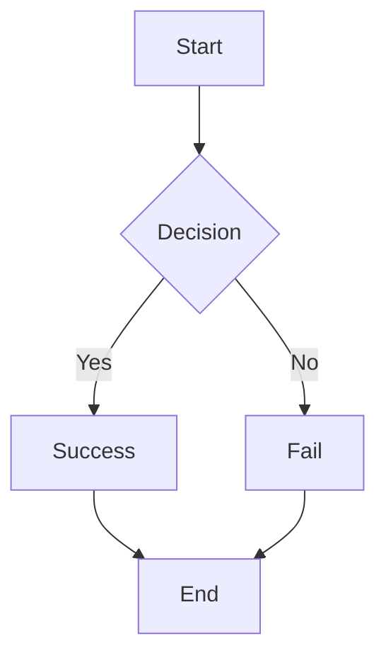
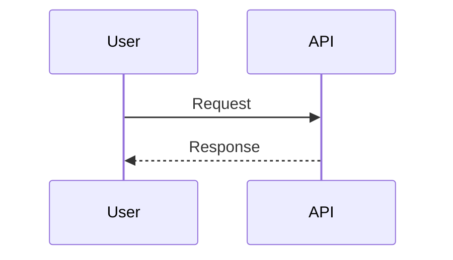

# API Usage Examples

This document provides real-world examples for using the GitHub README Preview API.

## Quick Reference

Base URL: `https://your-project.vercel.app/api/render`

## HTML Examples

### Example 1: Simple Heading

```markdown

```

**Decoded content**: `<h1>Hello World</h1>`

### Example 2: Card Component

```markdown

```

**HTML content**:
```html
<div class="card">
  <h2>Feature</h2>
  <p>Description</p>
</div>
```

**CSS**:
```css
.card {
  border: 1px solid #ddd;
  border-radius: 8px;
  padding: 20px;
}
```

### Example 3: Responsive Layout with Dark Theme

```markdown

```

## Markdown Examples

### Example 1: Document

```markdown
)
```

**Markdown content**:
```markdown
# Getting Started

## Installation

```bash
npm install
```

## Usage

See the [docs](https://example.com)
```

### Example 2: Table

```markdown

```

**Markdown table**:
```markdown
| Name  | Age |
| ----- | --- |
| Alice | 25  |
| Bob   | 30  |
```

## Code Examples

### Example 1: Python

```markdown

```

**Code content**:
```python
def fibonacci(n):
    if n <= 1:
        return n
    return fibonacci(n-1) + fibonacci(n-2)
```

### Example 2: JavaScript

```markdown

```

**Code content**:
```javascript
const greet = (name) => {
  console.log(`Hello, ${name}!`);
};

greet("World");
```

### Example 3: HTML

```markdown

```

### Example 4: All Supported Languages

The API supports 13+ languages:

```markdown


```

## Mermaid Examples

### Example 1: Flowchart

```markdown

```

**Mermaid content**:


### Example 2: Sequence Diagram

```markdown

```

**Mermaid content**:


### Example 3: Gantt Chart

```markdown

```

## Component Examples

### Example 1: Status Badge

```markdown


```

### Example 2: Stat Card

```markdown


```

### Example 3: Progress Bar

```markdown


```

### Example 4: Chart

```markdown

```

### Example 5: Table

```markdown

```

### Example 6: Dashboard

```markdown

```

## URL Encoding Helper

### Python Script

```python
import urllib.parse

def encode_param(text):
    return urllib.parse.quote(text)

def encode_json(data):
    import json
    return urllib.parse.quote(json.dumps(data))

# Example
html = '<h1>Hello</h1>'
print(f"?type=html&content={encode_param(html)}")

data = {"title": "Users", "value": "1,234", "color": "#0366d6"}
print(f"&data={encode_json(data)}")
```

### JavaScript Helper

```javascript
function encodeParam(text) {
  return encodeURIComponent(text);
}

function encodeJson(data) {
  return encodeURIComponent(JSON.stringify(data));
}

// Example
const html = '<h1>Hello</h1>';
console.log(`?type=html&content=${encodeParam(html)}`);

const data = { title: "Users", value: "1,234", color: "#0366d6" };
console.log(`&data=${encodeJson(data)}`);
```

### Bash Helper

```bash
#!/bin/bash

encode() {
  python3 -c "import urllib.parse; print(urllib.parse.quote('''$1'''))"
}

# Example
html='<h1>Hello</h1>'
encoded=$(encode "$html")
echo "?type=html&content=$encoded"
```

## Complete README Example

```markdown
# My Awesome Project

A production-ready solution for [description].

## Architecture


## Installation


## Code Example


## Status


---

Built with ❤️
```

## Tips & Tricks

### 1. Test URLs in Browser
Paste the full URL directly in your browser to see the SVG output.

### 2. Use Short URLs
For GitHub READMEs, consider using a URL shortener if URLs become too long.

### 3. Version Your Content
Include version numbers in alt text for clarity:
```markdown

```

### 4. Responsive Sizing
Adjust width/height for different contexts:
```markdown
<!-- Large preview -->


<!-- Small preview -->

```

### 5. Consistency
Use the same theme across all previews for a cohesive look:
```markdown
?theme=dark  <!-- All dark -->
?theme=light <!-- All light -->
```

---

For more information, see the main [README.md](./README.md)
