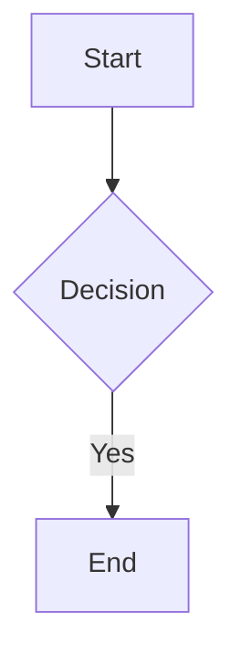

<<<<<<< HEAD
# API
=======
# GitHub README Preview System

A production-ready serverless API for generating dynamic SVG previews of HTML, Markdown, code, and Mermaid diagrams. Deploy to Vercel in minutes and embed rich previews directly in your GitHub READMEs.

## Features

✅ **HTML Preview** - Render HTML with sanitization and custom CSS  
✅ **Markdown Rendering** - Convert Markdown to SVG previews  
✅ **Code Syntax Highlighting** - 15+ languages supported via highlight.js  
✅ **Mermaid Diagrams** - Flowcharts, sequence, class, state, Gantt, pie charts  
✅ **UI Components** - Badges, stat cards, progress bars, charts, tables, dashboards  
✅ **Security First** - XSS prevention, HTML sanitization, input validation  
✅ **Serverless** - Runs entirely on Vercel Functions (no servers required)  
✅ **Caching** - Immutable SVG assets with long-lived cache headers  
✅ **CORS Enabled** - Works across all domains  

## Supported Languages

- **Web**: HTML, CSS, JavaScript, TypeScript
- **Backend**: Python, Java, Go, Ruby, PHP, Bash, Rust
- **Data**: JSON, YAML, SQL
- **Systems**: C, C++
- **Markup**: Markdown

## Installation

### 1. Clone the Repository

```bash
git clone https://github.com/yourusername/github-readme-preview.git
cd github-readme-preview
npm install
```

### 2. Install Dependencies

```bash
npm install
```

Installs:
- `marked` - Markdown parser
- `highlight.js` - Syntax highlighting
- `mermaid` - Diagram support
- `sanitize-html` - XSS protection
- `zod` - Input validation

### 3. Local Development

```bash
npm run dev
```

Starts Vercel dev server at `http://localhost:3000`

Test the API:
```
http://localhost:3000/api/render?type=html&content=<h1>Hello</h1>
```

## Deployment to Vercel

### Option 1: Using Vercel CLI

```bash
npm install -g vercel
vercel login
vercel --prod
```

### Option 2: GitHub Integration

1. Push to GitHub
2. Visit [vercel.com](https://vercel.com)
3. Import the repository
4. Deploy with one click

Your API is now live at: `https://your-project.vercel.app/api/render`

## API Documentation

### Base URL

```
https://your-project.vercel.app/api/render
```

### Query Parameters

| Parameter | Type | Required | Description |
|-----------|------|----------|-------------|
| `type` | string | Yes | `html`, `markdown`, `code`, `mermaid`, `component` |
| `content` | string | Yes | The content to render (URL encoded) |
| `language` | string | No | Programming language (for `code` type) |
| `css` | string | No | Custom CSS (for `html` type) |
| `title` | string | No | Optional title for the preview |
| `theme` | string | No | `light` or `dark` (default: `light`) |
| `width` | number | No | SVG width in px (default: 800, max: 1200) |
| `height` | number | No | SVG height in px (default: 600, max: 3000) |
| `component` | string | No | Component type (for `component` type) |
| `data` | JSON | No | Component data (for `component` type) |

### Response

**Content-Type**: `image/svg+xml`

**Cache**: `public, max-age=3600, immutable`

All responses are cached for 1 hour in Vercel's edge network.

## Usage Examples

### HTML Preview

```markdown

```

Rendered content:
```html
<h1>Hello World</h1>
<p>This is a preview</p>
```

### HTML with Custom CSS

```markdown

```

### Markdown Preview

```markdown

```

Markdown content:
```markdown
# Hello

This is **bold** and *italic*
```

### Code Highlighting

```markdown

```

Supported languages:
```
html, css, javascript, typescript, python, java, cpp, c, rust,
go, ruby, php, bash, markdown, json, yaml, sql
```

### Mermaid Flowchart

```markdown

```

Mermaid syntax:


### UI Components

#### Stat Card

```markdown

```

#### Badge

```markdown

```

#### Progress Bar

```markdown

```

#### Chart

```markdown

```

#### Table

```markdown

```

#### Dashboard

```markdown

```

## URL Encoding

Query parameters must be URL encoded. Use this online tool or encode programmatically:

**Python**:
```python
import urllib.parse
content = "<h1>Hello</h1>"
encoded = urllib.parse.quote(content)
```

**JavaScript**:
```javascript
const content = "<h1>Hello</h1>";
const encoded = encodeURIComponent(content);
```

**Bash**:
```bash
content='<h1>Hello</h1>'
encoded=$(python -c "import urllib.parse; print(urllib.parse.quote('$content'))")
```

## Security

The API implements multiple security layers:

### HTML Sanitization
- Blocks script tags and event handlers
- Allows safe HTML tags only (h1-h6, p, a, img, table, code, etc.)
- Removes dangerous attributes

### XSS Prevention
- All user input is validated with Zod
- HTML content is sanitized before rendering
- SVG injection is prevented
- JavaScript URLs are blocked

### Input Validation
- Maximum content length: 50KB
- Maximum CSS length: 10KB
- Valid language names only
- Proper Mermaid syntax validation

### URL Safety
- Only HTTP/HTTPS protocols allowed
- Image URLs are sanitized
- No arbitrary file access

## Performance

### Caching Strategy
- All responses cached for 1 hour at Vercel edge
- Immutable SVG assets (cache-busting via URL parameters)
- Browser cache: 3600 seconds

### Function Limits
- Max execution time: 30 seconds (Vercel default)
- Memory: 1024 MB (Vercel standard)
- No database calls (fully stateless)

### Response Size
Typical SVG sizes:
- Simple HTML: 3-10 KB
- Code block (100 lines): 5-15 KB
- Mermaid diagram: 2-8 KB
- Component: 2-5 KB

## Project Structure

```
.
├── api/
│   ├── render.ts              # Main API endpoint
│   └── _types.ts              # TypeScript types
├── src/
│   ├── parsers/
│   │   ├── html.ts            # HTML parser
│   │   ├── markdown.ts        # Markdown to HTML
│   │   ├── code.ts            # Syntax highlighting
│   │   └── mermaid.ts         # Mermaid validation
│   ├── renderers/
│   │   ├── svg.ts             # SVG builder utilities
│   │   └── components.ts      # Component renderers
│   └── utils/
│       ├── validation.ts      # Input validation (Zod)
│       ├── sanitize.ts        # XSS protection
│       └── encoding.ts        # URL/SVG encoding
├── package.json
├── tsconfig.json
├── vercel.json
└── README.md
```

## Development

### Build

```bash
npm run build
```

Compiles TypeScript to `dist/`.

### Testing Locally

```bash
npm run dev
```

Then visit:
```
http://localhost:3000/api/render?type=html&content=%3Ch1%3ETest%3C/h1%3E
```

### Environment Variables

Set in `vercel.json`:
```json
{
  "env": {
    "MAX_CONTENT_LENGTH": "50000",
    "MAX_SVG_WIDTH": "1200",
    "MAX_SVG_HEIGHT": "3000"
  }
}
```

## Troubleshooting

### 400 Bad Request
- Check that `type` and `content` are provided
- Ensure content is URL encoded
- Verify parameters match schema

### 404 Not Found
- The `/api/render` endpoint should be at `https://your-project.vercel.app/api/render`
- Check that TypeScript was compiled

### Invalid Mermaid Diagram
- Verify diagram syntax is correct
- Check for unclosed brackets: `[]` `()` `{}`
- Supported types: graph, flowchart, sequenceDiagram, classDiagram, stateDiagram, gantt, pie

### XSS Protection Errors
- `<script>` tags and event handlers are removed
- Only safe HTML tags are allowed
- Use `sanitize.ts` to see the allowlist

## Examples

### GitHub README Integration

```markdown
# My Project

## Architecture


## Code Sample


## Status


```

## API Reference

### /api/render (GET)

```bash
curl "https://your-project.vercel.app/api/render?type=html&content=%3Ch1%3EHello%3C/h1%3E"
```

Returns SVG image directly.

## Rate Limiting

Currently no built-in rate limiting. For production:
1. Add Vercel Rate Limiting middleware
2. Implement API keys in query parameters
3. Use Upstash for distributed rate limiting

## Performance Monitoring

Monitor with:
1. Vercel Analytics Dashboard
2. Datadog / New Relic integration
3. Custom logging to Vercel Functions

## Contributing

1. Fork the repository
2. Create a feature branch
3. Make changes and test locally
4. Submit a pull request

## License

MIT License - See LICENSE file for details

## Support

- **Issues**: GitHub Issues
- **Discussions**: GitHub Discussions
- **Docs**: This README and inline code comments

## Roadmap

- [ ] Client-side Mermaid rendering to SVG
- [ ] Dark mode diagrams
- [ ] Custom font support
- [ ] Interactive elements (hover tooltips)
- [ ] Multi-page document support
- [ ] PDF export option
- [ ] Rate limiting tier system
- [ ] Custom branding/styling

---

Built with ❤️ for GitHub README previews. Deploy today with `vercel --prod`!
# Readme-API
# Readme-API
# Readme-API
>>>>>>> 72b407e (first commit)
